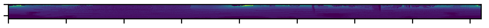
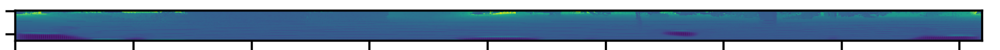
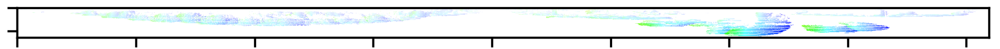
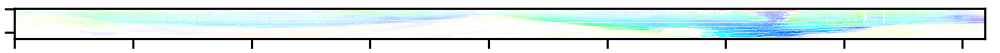
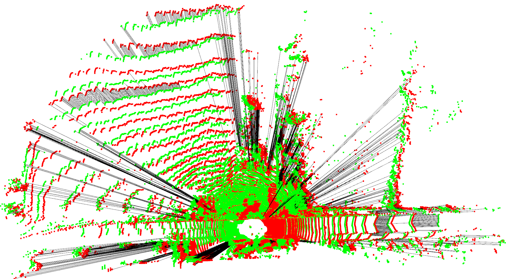

# S2lece - Self Supervised Learning for LiDAR Point Cloud Correspondence Estimation

Self-supervised learning to estimate point-to-point correspondences within 2D
range images of LiDAR point clouds. Inspired from RangeNet++ and RAFT.

## How to run
Change the flag to True if you want to train or evaluate Autoencoder. Change to False
before running S2lece model. 

To train the model
```
python main.py --train
```

To train from a checkpoint
```
python main.py --train --runId <path-to-checkpoint-from-the-training>
```

To evaluate the model
```
python main.py --runId <path-to-run-folder-from-the-training>
```

## Result

### Training result

| Model        | Dataset     | Train size* | Validation size* | Training loss | Validation loss |
|--------------|-------------|-------------|------------------|---------------|-----------------|
| Autoencoder  | KITTI (a)   | 8293        | 1355             | 1.829         | 0.3795          |
| S2Lece       | KITTI (o)   | 7707        | 857              | 23.302        | 29.72           |

AuoEncoder - Actual Image: <br />


AuoEncoder - Predicted Image: <br />


S2lece - Ground truth Optical flow: <br />


S2lece - Predicted Optical flow: <br />


Visualization of 10% Correspondence between point clouds: <br />
